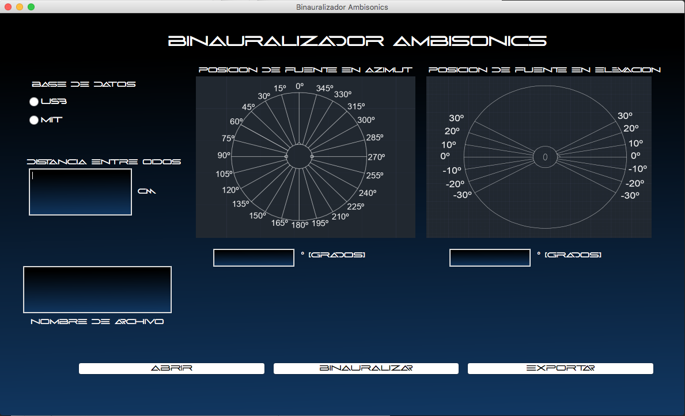
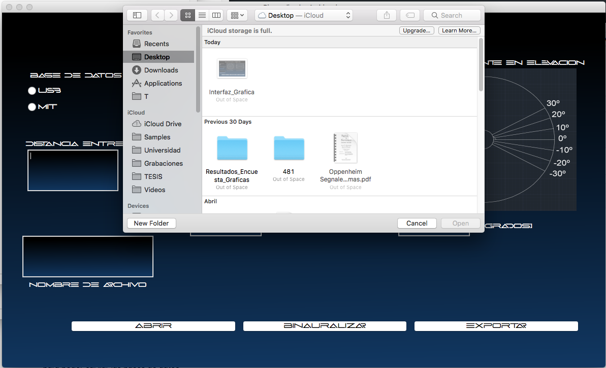
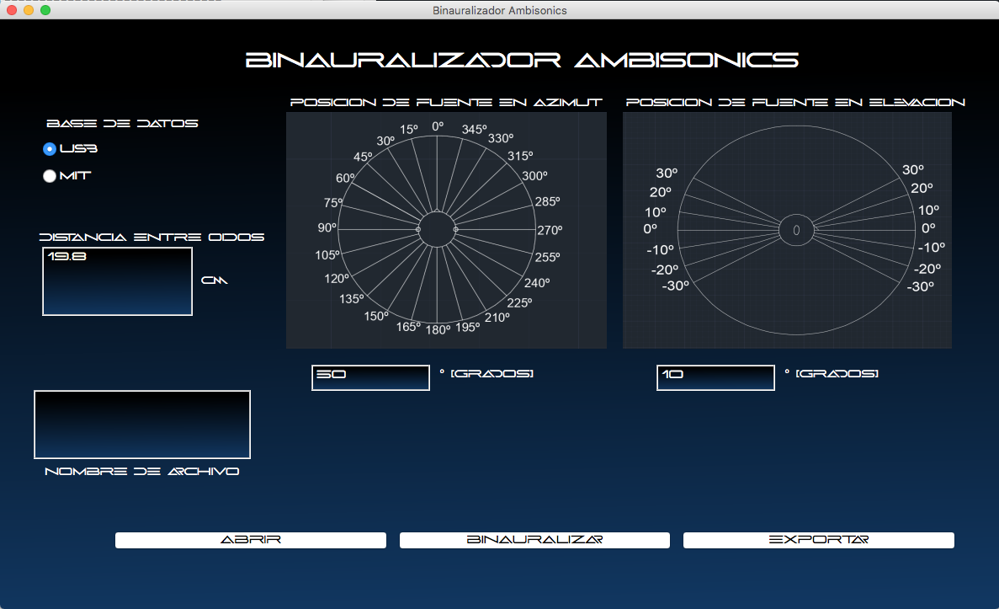
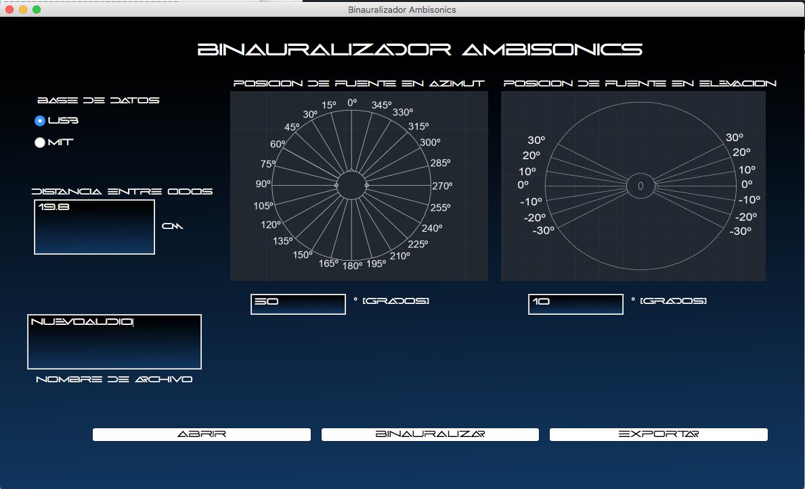
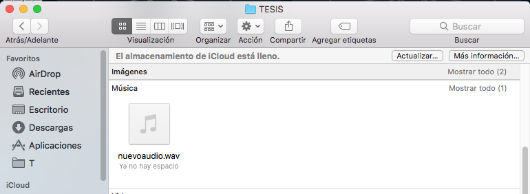

# Binauralizador Ambisonics format B
Este proyecto tiene como fin binauralizar audio ambisonics implementando el modelo de Woodworth

## Pre-requisitos
Para poder correr el programa es necesario tener Python 3.7.4
De igual manera, es necesario tener instalado las librerias mencionadas en librerias.txt

Una vez descargado el repositorio e instalado las librerias mencionadas en librerias.txt, es necesario tener en cuenta la ruta de directorio para poder cargar las bases de datos

Para ello es necesario ingresar al archivo MainWindow.py y modificar la ruta de directorio al directorio local donde se descarguen dichos archivos

Primero debemos actualizar la ruta de directorio del escritorio, en el archivo MainWindow.py en la función def abrirarchivo(self), allí debemos poner la ruta local de nuestro escritorio.

```
directorio = '/Users/cristianpedraza/Desktop/'
```
Segundo debemos actualizar la ruta de directorio local donde se encuentra la carpeta TESIS dentro de nuestro computador, en el archivo MainWindow.py en la funcion def Binauralizar(self).

```
directorio ='/Users/cristianpedraza/Documents/Universidad/' 
```
Una vez actualizado dichos directorios podemos correr la aplicación dentro de nuestro ordenador

# ¿Como funciona?

El Binauralizador Ambisonics format B funciona de una manera facíl y practica.

<br>

<br>

Primero debemos cargar un audio Ambisonics format b (AmbiX o FuMa), de no ser así el programa muestra un mensaje de advertencia, solicitando al usuario seleccionar el archivo de audio correcto.

<br>

<br>

Una vez cargado dicho archivo, procedemos a binauralizar este. Para ello es necesario ingresar la distancia entre oídos del usuario, seleccionar la base de datos que se desea utilizar (MIT o USB) y seleccionar la posicion donde se desea ubicar dicho audio. (Plano horizontal (Azimuth) y Plano vertical (elevación)).

<br>

<br>

Para poder binauralizar dicho audio damos click en el botón Binauralizar.

Por último, ingresamos el nombre del archivo nuevo a crear y damos click en el botón exportar.

<br>

<br>

El archivo de audio post-procesado se encuentra en la misma carpeta donde se descargo el repositorio, es decir, dentro de la carpeta TESIS

<br>

<br>
